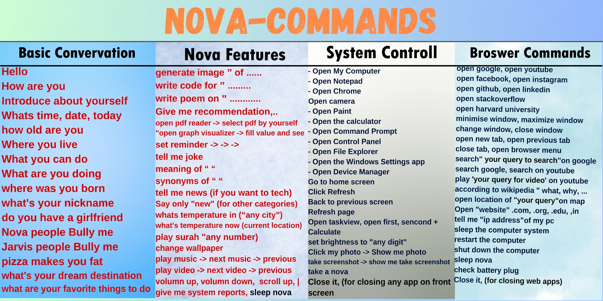

# Nova AI

A voice-controlled desktop assistant built with Python.

## Developers

[Muhammad Abdullah Rasheed](https://abdullahrasheed.tech), [Adil Hayyat](https://github.com/Adil-Hayyat) and [Jabran Adeel](github.com/jabran-adeel)  
Final Year Project (FYP)

## Features

- Speech recognition through a microphone and spoken replies.
- Voice-commanded application and website launching, browser controls, and desktop actions.
- Music playback from `Music/` and video playback from `Playlist/` using the system's default applications.
- Weather reports for a named city or the configured default city.
- Wikipedia summaries, Google and YouTube searches, and dictionary definitions and synonyms.
- PDF reading interface (requires setup; the voice command depends on an optional PDF module).
- News headlines (requires setup; the News API key file and optional news module are not included).
- Wallpaper changes using images in `Wallpapers/`.
- System information and battery status and alerts.
- Quran audio playback from `Quran_Majeed/`.
- Face verification (requires setup; the face-recognition trainer is not included).
- Eye-controlled mouse support in a standalone module; it is not started by the voice-command flow.
- Image generation, code generation, and conversational chat (requires setup; their optional modules are not included).
- Translation of recognized voice queries into English.
- Map searches for a spoken location.

## Tech stack

Python, PyQt5, SpeechRecognition, PyAudio, pyttsx3, OpenCV, PyAutoGUI, Pygame, PyMuPDF, Requests, BeautifulSoup, Wikipedia, `mtranslate`, `geopy`, `geocoder`, `psutil`, Mediapipe, and OpenAI. Some are used by optional features.

## Project structure

- `NOVA/MAIN/` — PyQt5 application entry point and startup flow (`Main.py`).
- `NOVA/FUNCTION/` — Voice-command handling and assistant features.
- `NOVA/Body/` — Speech recognition and speech output.
- `NOVA/Brain/` — API-backed assistant logic and optional local Q&A loading.
- `NOVA/Automations/` — Battery monitoring and desktop automation helpers.
- `NOVA/GUI/` — PyQt5 interface and its visual assets.
- `NOVA/Data/` — Dialog text and sound effects.
- `NOVA/MainBuddy/` — Assistant startup, greeting, and face-verification flow.
- `Memory/` — Notes and assistant context.
- `Music/` — Audio files used for music playback.
- `Playlist/` — Video files used for playlist playback.
- `Quran_Majeed/` — Quran recitation audio files.
- `Wallpapers/` — Images used by the wallpaper changer.

The entry point is `NOVA/MAIN/Main.py`.

## Installation and Running

Python 3.10 to 3.12 is recommended.

### Windows

1. Install Python 3.10 and clone the project anywhere.
2. From the project root, create and activate a virtual environment, then install requirements:
   ```powershell
   python -m venv venv
   venv\Scripts\activate
   pip install -r requirements.txt
   ```
3. Configure the required API keys in the expected local configuration files.
4. Start Nova AI:
   ```powershell
   python NOVA\MAIN\Main.py
   ```

### Ubuntu

1. Install Python 3.10 or newer, then clone the project anywhere.
2. Install system dependencies:
   ```bash
   sudo apt install python3 python3-venv python3-pip python3-tk portaudio19-dev espeak-ng ffmpeg flac xdg-utils
   ```
3. From the project root, create and activate a virtual environment, then install requirements:
   ```bash
   python3 -m venv venv
   source venv/bin/activate
   pip install -r requirements.txt
   ```
4. Configure the required API keys in the expected local configuration files.
5. Start Nova AI:
   ```bash
   python3 NOVA/MAIN/Main.py
   ```

For desktop automation, log in to **Ubuntu on Xorg**; PyAutoGUI does not work reliably on Wayland. The wallpaper command uses GNOME settings.

## Configuration

The repository does not include API keys or face-recognition training files. Add any credentials locally and keep them out of Git.

- **Assistant password:** Set the `NOVA_PASSWORD` environment variable, or create `NOVA/Data/password.txt` and put the password on its first line. The environment variable takes precedence. The password file is ignored by Git; `NOVA/Data/password.txt.example` is a placeholder template.

- **News API:** `NOVA/FUNCTION/NewsRead.py` reads a News API key from `NOVA/DataBase/news`. Create that file and place the key in it. The optional `NOVA/FUNCTION/News.py` module is also absent, so the basic news command needs that integration supplied.
- **OpenAI / Brain:** `NOVA/Brain/AIBrain.py` reads its API value from `NOVA/Data/API.txt`. That file is not included. The module also uses this file as its chat-log template.
- **Hugging Face:** No Hugging Face key is read by the Python files currently in `NOVA/`. The image and code-generation modules that could define their own credentials are absent; configure keys according to those modules if you add them.
- **Face verification:** Add the trained model at `NOVA/FUNCTION/Face_Recognition/trainer/trainer.yml`. The cascade file may be placed at `NOVA/FUNCTION/Face_Recognition/haarcascade_frontalface_default.xml`; otherwise the code tries OpenCV's bundled cascade.
- **Chat and local Q&A:** The optional `NOVA/Brain/Osrc/Chat.py` and `NOVA/Data/qna.txt` are not included. The project does include `NOVA/Data/data/qna.json`, but the `Brain/load_file.py` loader expects `qna.txt`.

Do not commit keys, model files, or other private configuration.

## Usage

From the project root, start the GUI with the platform-specific command above. Press **Start** and say **“wake up”** or **“nova”** to activate the assistant.

Example voice commands implemented in the command handler:

- “open Google”
- “according to Wikipedia, what is a black hole”
- “how's weather in London”
- “open location of Paris on map”
- “play music”
- “play surah 1”
- “change wallpaper”
- “take a note”

See the command list image for more examples:



## Known limitations

- News, chat, image and code generation, PDF voice commands, and face verification depend on optional files, modules, or keys that are not included.
- Brightness and Wi-Fi controls depend on compatible hardware, system tools, and optional packages. Availability varies by Linux desktop and hardware.
- On Ubuntu, use the **Ubuntu on Xorg** session for PyAutoGUI desktop controls. Wallpaper changes use GNOME settings.
- Speech recognition requires a working microphone and internet access for Google's recognition service. Weather, Wikipedia, maps, and translation also use online services.
